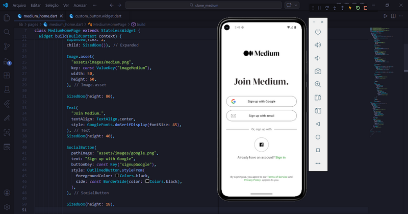

# 📱 Medium Clone – Flutter

Clone da tela inicial do **Medium** desenvolvido em Flutter como prática de UI, componentização e boas práticas de layout.

Projeto focado em:
- reutilização de widgets
- organização de layout com Column/Row
- uso de Keys para testes
- responsividade
- componentes customizados

---

## 📸 Screenshot



---

## 🚀 Funcionalidades

✅ Logo do Medium  
✅ Botões sociais (Google / Email / Facebook)  
✅ Divisor com texto central  
✅ Texto clicável (Sign in)  
✅ Termos e políticas clicáveis  
✅ Layout responsivo  
✅ Keys para testes automatizados  

---

## 🧩 Componentes criados

### 🔹 SocialButton
Botão reutilizável com:
- ícone
- texto
- estilo customizável
- suporte a Key

### 🔹 CircleIconButton
Botão circular para redes sociais

### 🔹 CustomButton
Preparado para futuras ações principais

---

## 🛠️ Tecnologias utilizadas

- Flutter
- Dart
- Material Design
- Google Fonts

---

## ▶️ Como rodar o projeto

```bash
# clonar
git clone https://github.com/aleehblackstar/clone_medium.git

# entrar na pasta
cd clone_medium

# instalar dependências
flutter pub get

# executar
flutter run
